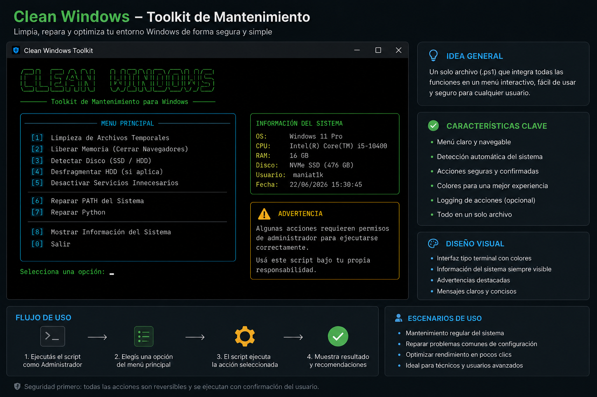

# Clean Windows Toolkit

Herramienta simple para mantenimiento, limpieza y reparación básica de entornos Windows, pensada para técnicos, sysadmins y usuarios avanzados.



## Qué hace

`Clean-Windows.ps1` reúne en un menú interactivo tareas habituales de diagnóstico y mantenimiento. La herramienta detecta los privilegios disponibles, solicita confirmación antes de cambios sensibles y muestra un resumen después de cada acción.

## Características

- Limpia archivos temporales del usuario y, con privilegios elevados, de Windows.
- Cierra navegadores conocidos únicamente después de confirmar.
- Detecta discos SSD/HDD y bloquea la desfragmentación cuando no puede confirmar un HDD.
- Permite revisar y desactivar, uno por uno, servicios opcionales conocidos.
- Audita y normaliza el PATH sin borrar rutas no verificables, con backup previo.
- Detecta una instalación real de Python 3, la prioriza en el PATH de usuario y verifica `pip`.
- Muestra información útil del sistema.
- Ejecuta opcionalmente `safe_whisper.py` si Python, FFmpeg y Whisper están disponibles.
- No realiza debloat, no desinstala programas y no descarga dependencias.

## Requisitos

- Windows 10 o Windows 11.
- Windows PowerShell 5.1 o PowerShell 7.
- Algunas operaciones requieren una consola ejecutada como Administrador.
- Para `safe_whisper.py`: Python 3, FFmpeg y el paquete Python `whisper` ya instalados.

No se requieren módulos externos de PowerShell.

## Cómo ejecutar

Abrí PowerShell en la carpeta del proyecto y ejecutá:

```powershell
powershell -ExecutionPolicy Bypass -File .\Clean-Windows.ps1
```

Para disponer de todas las opciones, iniciá PowerShell como Administrador. Sin elevación, el menú sigue funcionando y avisa qué acciones se omiten o tienen alcance limitado.

## Advertencias

- Revisá cada confirmación antes de aceptarla.
- Guardá el trabajo del navegador antes de usar la opción para liberar memoria.
- La limpieza conserva archivos bloqueados o en uso.
- La desfragmentación solo se habilita cuando la unidad se identifica explícitamente como HDD.
- La reparación de PATH conserva rutas inexistentes o no verificables por seguridad y guarda una copia en `backups/` antes de modificarlo.
- Desactivar telemetría puede reducir datos de diagnóstico enviados a Microsoft. Cada servicio se confirma por separado y puede reactivarse desde `services.msc`.
- Usá esta herramienta bajo tu propia responsabilidad y, en equipos críticos, probala primero en un entorno controlado.

## Estructura del proyecto

```text
Clean_windows/
├── Clean-Windows.ps1
├── safe_whisper.py
├── assets/
│   └── clean-windows-mockup.png
├── legacy/
│   ├── bat_para_limpiar
│   ├── clean_path.ps1
│   ├── fix_path.ps1
│   └── fix_python.ps1
└── README.md
```

Los scripts originales se conservan en `legacy/` solo como referencia histórica. La herramienta soportada es `Clean-Windows.ps1`.

## Licencia

Distribuido bajo la licencia MIT.
